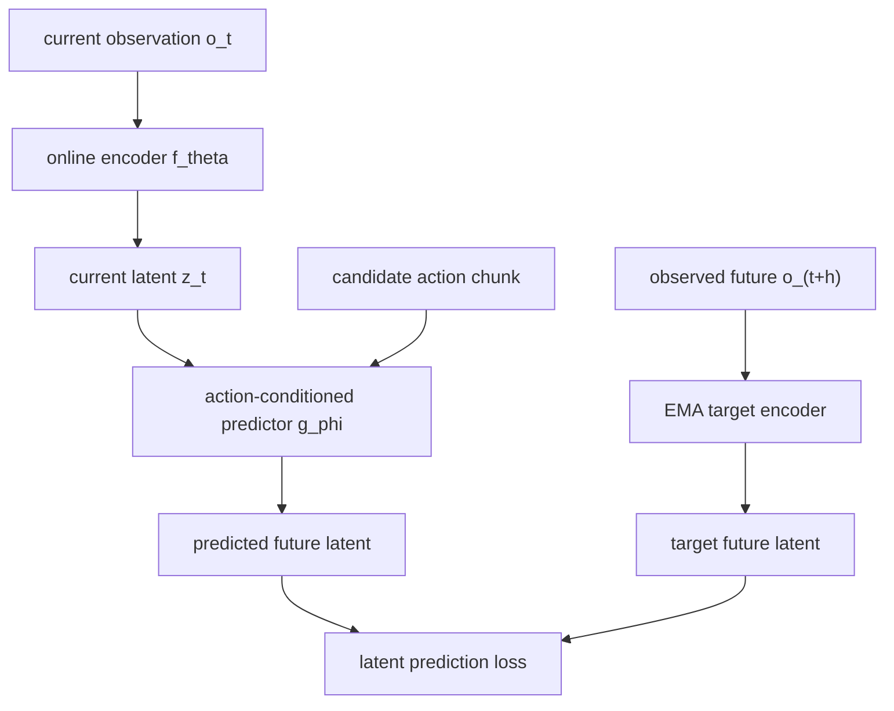

The appealing story behind a learned world model is simple:

1. predict what each candidate action will cause;
2. choose the prediction closest to the goal;
3. execute a small part of that plan and repeat.

I built a compact, action-conditioned JEPA world model to see how far this story
survives contact, momentum, long horizons, and dexterous manipulation. The model
uses low-dimensional simulator state rather than pixels, and the Fetch variants
are only about 1.7–2.0 million parameters. The point was not to hide control
problems behind scale.

The most useful result was not that one model solved every environment. It was a
cleaner decomposition of the control problem:

> The world model predicts consequences. An action model proposes feasible
> ways to reach a future. A hierarchy decides which futures are worth
> predicting.

This distinction explains nearly every successful controller in the project.
It also explains why simply increasing the planning horizon often made the
controller worse.

The code and exact experiment ledger are available in
[mini-JEPA](https://github.com/WilliamZhang20/mini-JEPA). The numbers below are
local, seed-controlled development results, not cross-paper benchmark
comparisons.

## The model

A JEPA predicts in representation space instead of reconstructing the entire
future observation. The general joint-embedding idea was introduced by Assran
et al. <d-cite key="assran2023ijepa"></d-cite>; here it becomes an
action-conditioned state model.

Let \(o_t\) be the normalized observation and let
\(\mathbf a_{t:t+h-1}\) be an action sequence. The online encoder produces the
current latent,

$$
z_t = f_\theta(o_t),
$$

while an exponential-moving-average target encoder produces the regression
target,

$$
\bar z_{t+h} = f_{\bar\theta}(o_{t+h}), \qquad
\bar\theta \leftarrow \mu\bar\theta + (1-\mu)\theta.
$$

The recurrent predictor rolls the latent forward under the action sequence:

$$
\hat z_{t+i}
=
g_\phi\!\left(\hat z_{t+i-1},\, a_{t+i-1},\, i/h_{\max}\right),
\qquad
\hat z_t=z_t.
$$

The main predictive loss compares normalized latents at several horizons:

$$
\mathcal L_{\mathrm{pred}}
=
\frac{1}{|\mathcal H|}
\sum_{h\in\mathcal H}
\left\|
\frac{\hat z_{t+h}}{\|\hat z_{t+h}\|_2}
-
\frac{\bar z_{t+h}}{\|\bar z_{t+h}\|_2}
\right\|_2^2 .
$$

Variance and off-diagonal covariance penalties keep the representation from
collapsing, following the useful part of the VICReg recipe
<d-cite key="bardes2022vicreg"></d-cite>. Small probes decode state and goal
geometry from the latent. For some models, an inverse-dynamics head also
predicts the action chunk between \(z_t\) and \(z_{t+h}\), forcing the encoder
to preserve control-relevant detail.



This model is genuinely useful on smooth, locally controllable dynamics. On
FetchReach, latent MPC can optimize primitive action sequences directly. That
baseline matters because it shows that the predictor is not merely an auxiliary
feature extractor.

Contact exposes the missing piece.

## Where the data came from

Data collection is part of the method, not bookkeeping. There are two distinct
roles for data in these experiments:

1. **world-model transitions** provide tuples
   \((o_t,\mathbf a_{t:t+h-1},o_{t+h})\) for learning latent dynamics;
2. **behavior data** provides the action chunks used to train inverse or flow
   proposal models and to identify useful phases or subgoals.

The exact source depends on the task:

| Task | World-model data | Proposal or hierarchy data |
|---|---|---|
| FetchReach | A mixture of scripted and random interaction with action noise | None for the pure latent-MPC controller |
| FetchPush / FetchPickAndPlace | Noisy scripted/random trajectories; the default recipe collects 400k transitions per task | Separate, more expert-heavy banks: 100k mostly scripted transitions for Push and 80k scripted transitions for Pick |
| FetchSlide | Scripted pre-alignment followed by a structured sweep over strike angle, amplitude, and duration | The same macro trials, including misses, plus one round of planner-selected calibration data |
| PointMaze | Trajectories from a scripted maze controller | Route windows and local action chunks extracted from those trajectories |
| Adroit / Kitchen | Offline D4RL expert demonstrations imported through Minari | Demonstration segments split by contact regime, possession, subtask completion, or handoff boundaries |

Keeping unsuccessful Slide strikes is especially important: endpoint prediction
needs the response surface around a good strike, not only successful examples.
For Kitchen, demonstrations are replayed and aligned with object-state changes
to label subtask segments; the completion probe and handoff graph are then
learned from those aligned trajectories.

This makes **self-supervised** narrower than it can sound. JEPA targets, future
indices, phase labels, and handoff costs are derived automatically from
trajectories without reward, critic, or value labels. The action priors,
however, are trained on the actions recorded in those trajectories. A more
precise description is *self-supervised representation learning plus
trajectory-supervised action modeling*. The pipeline is reward-free and
future-conditioned; it is not demonstration-free, and random exploration did
not discover grasping, dexterity, or Kitchen task sequences.

Evaluation uses fresh rollouts and held-out seeds. The learned controllers do
not receive scripted expert actions at test time; the scripted policies are
data-collection tools, not hidden components of the reported controllers.

## Prediction is not proposal

Suppose a planner evaluates \(N\) action chunks. Even a perfect world model can
only choose among those \(N\) candidates. If none contains a coherent grasp or
push, prediction quality does not help.

This becomes severe with temporally precise contact. A useful grasp is a tiny
region in a high-dimensional action-sequence space. Sampling each action from a
wide Gaussian almost never enters that region, and local optimization receives
little signal before contact occurs.

The successful controllers therefore separate two jobs:

- a **proposal model** samples action chunks that resemble feasible behavior;
- the **JEPA predictor** estimates what each proposed chunk will cause.

Recent work such as SAGE makes the same proposal-versus-evaluation distinction
explicit for latent world-model planning
<d-cite key="cheng2026sage"></d-cite>. In this project, I used two proposal
models.

For relatively unimodal transitions, a deterministic inverse model predicts a
chunk directly:

$$
q_\omega(z_t,\bar z_{t+h},h,\gamma_t)
\longrightarrow
\hat{\mathbf a}_{t:t+H-1},
$$

where \(\gamma_t\) contains a small amount of task geometry. This works well
for FetchPickAndPlace once a future transition specifies the grasp-and-lift
direction.

For multimodal transitions, I used conditional flow matching
<d-cite key="lipman2023flow"></d-cite>. Let
\(\mathbf a_1\) be an observed action chunk and
\(\mathbf a_0\sim\mathcal N(0,I)\). Along the straight interpolation

$$
\mathbf a_\tau=(1-\tau)\mathbf a_0+\tau\mathbf a_1,
\qquad \tau\sim\mathcal U[0,1],
$$

the network learns the velocity

$$
\mathcal L_{\mathrm{flow}}
=
\left\|
v_\psi(\mathbf a_\tau,\tau\mid c)
-
(\mathbf a_1-\mathbf a_0)
\right\|_2^2,
$$

conditioned on

$$
c=[z_t,\bar z_{t+h},h,\gamma_t].
$$

At runtime the flow produces several complete action chunks. The frozen JEPA
rolls them forward, and the controller selects

$$
\mathbf a^\star
=
\underset{\mathbf a^{(i)}\sim q_\psi(\cdot\mid c)}{\arg\min}
\left[
\lambda_z d\!\left(\hat z_{t+H}^{(i)},z_{\mathrm{target}}\right)
+
\lambda_x d_x\!\left(\hat o_{t+H}^{(i)},o_{\mathrm{target}}\right)
+
\lambda_\Delta R(\mathbf a^{(i)})
\right].
$$

The latent term checks semantic reachability, the decoded-state term checks
task geometry, and \(R\) discourages unnecessarily large or discontinuous
actions. Only the first few actions are executed before replanning.

This division of labor solved two contact tasks:

- **FetchPush:** a flow prior proposes coherent eight-step pushes; JEPA ranks
  them. The checked 30-episode run reached 1.00 success with about 8 mm mean
  final distance.
- **FetchPickAndPlace:** a future-conditioned inverse prior proposes
  grasp-and-lift chunks; JEPA ranks local variants. The checked 30-episode run
  reached 1.00 success with about 11 mm mean final distance.

The important point is not that flow matching is always better than an inverse
MLP. The important point is that the proposal distribution is part of the
controller. Deterministic inverse models are useful when the inverse is nearly
single-valued; flows are useful when several action sequences can realize the
same future.

## Predict events, not frames

FetchSlide produced the clearest change in architecture.

The goal lies outside the robot's reach. The gripper must hit a puck, withdraw,
and let the puck coast under friction. Once the impact is over, there is little
corrective authority. A controller that replans every few simulator frames is
using the wrong unit of time.

The correct high-level transition is not

$$
o_t \rightarrow o_{t+1}\rightarrow\cdots\rightarrow o_{t+24}.
$$

It is

$$
\text{aligned pre-impact state}
\xrightarrow{\text{strike macro}}
\text{post-coast resting state}.
$$

I represented a strike by the compact macro

$$
m=[d_x,d_y,\alpha,\tau/\tau_{\max}],
$$

containing direction, amplitude, and duration. An event-conditioned HWM takes
the pre-impact JEPA latent and the strike features, then predicts both the
post-coast latent and the final puck displacement:

$$
\left\{
\hat z_{\mathrm{rest}}^{(k)},
\widehat{\Delta p}_{\mathrm{rest}}^{(k)}
\right\}_{k=1}^{K}
=
G_\eta(z_{\mathrm{impact}},m,\gamma_{\mathrm{impact}}).
$$

The \(K\) heads form a small ensemble. Planning enumerates goal-relative
macros and minimizes endpoint error plus ensemble disagreement:

$$
J(m)
=
\left\|
p_{\mathrm{impact}}
+
\mathbb E_k[\widehat{\Delta p}^{(k)}_{\mathrm{rest}}]
-
p_{\mathrm{goal}}
\right\|_2
+
\lambda_u
\left\|
\operatorname{Std}_k[
\widehat{\Delta p}^{(k)}_{\mathrm{rest}}
]
\right\|_2.
$$

The first event model still had to learn essentially the same strike response
at every table orientation. The second model removes that burden by expressing
the physics in a live goal frame. If

$$
e_\parallel
=
\frac{p_{\mathrm{goal}}-p_{\mathrm{puck}}}
{\|p_{\mathrm{goal}}-p_{\mathrm{puck}}\|_2},
\qquad
e_\perp=[-e_{\parallel,y},e_{\parallel,x}],
$$

then contact offsets, velocities, strike direction, and predicted displacement
are projected onto \((e_\parallel,e_\perp)\). Fourier features encode the
continuous strike parameters, and gated residual blocks predict the endpoint
in canonical coordinates.

Training also samples final-distance quantile bins uniformly. This is not a
reward or success label: it prevents the many inaccurate endpoints from
drowning out the rarer precise transitions in a geometric regression problem.
One calibration round then adds the planner's selected strikes and their
observed endpoints back to the same event model.

The resulting commit-and-coast controller achieved 0.848 and 0.857 on two
independent 1,000-episode blocks, for a reported aggregate rate of 0.853 over
2,000 trials.

This result has an important boundary. A scripted geometric stage still aligns
the gripper before impact. The learned contribution is strike selection and
event prediction, not end-to-end visual manipulation.

<!--
Replace this comment with assets/img/jepa/temporal-abstraction.svg.
See JEPA-figure-briefs.md, Figure 2.
-->

## Three kinds of hierarchy

The Slide controller uses hierarchy to change the time scale. Other tasks need
hierarchy for different reasons.

### Spatial hierarchy

In PointMaze, primitive dynamics are smooth but the route is long. A low-level
walker can reach a nearby coordinate; it should not be asked to plan through
several walls in one action sequence.

Following the HWM idea of coupling temporal levels in a shared latent space
<d-cite key="zhang2026hwm"></d-cite>, a macro-action encoder compresses a
primitive chunk,

$$
m_t=E_a(a_{t:t+N-1}),
$$

and a high-level model predicts an abstract latent transition,

$$
z^H_{t+N}
=
z^H_t + g_H(z^H_t,m_t).
$$

A decoder maps the predicted abstract latent to a local position subgoal. The
same proposal lesson reappears at the high level: Gaussian search over
macro-actions can invent transitions through walls, so a flow prior samples
macro-actions from demonstrated route segments,

$$
m_t\sim q_\psi(m\mid z^H_t,p_{\mathrm{goal}}).
$$

The HWM predicts the next abstract state, the decoder emits a nearby subgoal,
and the low-level flow walker reaches it. In checked runs, this fully neural
controller reached 1.00 success on PointMaze UMaze, Medium, and Large without
storing a reachability graph.

### Physical-mode hierarchy

Adroit Relocate needs a different factorization. Reaching for a ball and
transporting a held ball are not two points on one smooth action manifold:
they are different physical modes.

A single inverse model blurred three regimes—reach, establish possession, and
transport/place. The successful controller instead uses two segment-pure
future-conditioned inverse specialists:

- a **reach specialist**, trained only before firm possession and emphasizing
  live palm-to-ball geometry;
- a **held specialist**, trained only after firm possession and emphasizing
  live ball-to-target geometry.

A conservative possession predicate switches between them. Each specialist
tracks one demonstrated future trajectory rather than jumping to whichever
demonstration frame is nearest at every replan.

This controller reached 201 successes in 210 held-out episodes (0.957). The
general lesson is:

> Do not average action distributions that belong to different contact modes.

The predicate is deliberately firm: switching early hands a marginal grasp to
the transport specialist, which was a common source of drops.

### Task hierarchy

FrankaKitchen composes several object interactions. Here the hierarchy is not
only temporal or physical; it also decides which task should happen next.

The low level again uses segment-pure inverse specialists—one for each object.
A learned completion probe consumes the frozen JEPA latent plus normalized
state and decides when to advance. Inside a specialist, a demo-locked future
index gives the inverse model a consistent local trajectory to follow.

The harder problem is task order. Greedily selecting the specialist whose
demonstrations look closest to the current arm pose ignores the state in which
that specialist will finish. Instead, the controller builds a directed handoff
graph from demonstration boundaries.

For tasks \(a\) and \(b\), define the edge cost

$$
c(a\rightarrow b)
=
Q_{0.25}
\left(
\min_{y\in\operatorname{Start}(b)}
\left\|
\mathcal N(x)_{0:9}-\mathcal N(y)_{0:9}
\right\|_2
\;:\;
x\in\operatorname{End}(a)
\right).
$$

The arm-joint slice \(0{:}9\) measures handoff reachability. The lower quantile
makes the edge robust to outlier demonstrations while asking whether the
handoff is well represented somewhere in the data.

A tiny subset dynamic program then solves

$$
\pi^\star
=
\underset{\pi\in\operatorname{Perm}(S)}{\arg\min}
\left[
c_{\mathrm{start}}(\pi_1)
+
\sum_{i=1}^{|S|-1}c(\pi_i\rightarrow\pi_{i+1})
\right]
$$

for the requested task subset \(S\).

When given the deliberately scrambled four-task request

```text
slide, light, microwave, kettle
```

the learned handoff costs reconstruct

```text
microwave -> kettle -> light -> slide
```

With the learned completion probe and live demo re-locking, this controller
completed all four tasks in 80 of 100 fresh episodes across four seed blocks.
This is a narrower and more defensible claim than “arbitrary task order”: the
controller discovers a well-supported order for a requested subset, while the
demonstrations still determine which handoffs are feasible.

## Results

The table collects the results that directly support the architectural story.
Success definitions differ by environment, so rows should be read within a
task—not as a leaderboard across tasks.

| Environment | Controller | Checked result | Architectural point |
| --- | --- | ---: | --- |
| FetchPush | future-conditioned flow + JEPA ranking | 30/30; ~8 mm final distance | propose on the action manifold |
| FetchPickAndPlace | inverse chunk prior + JEPA ranking | 30/30; ~11 mm final distance | prediction is not inverse control |
| FetchSlide | goal-frame event HWM | 0.853 over 2,000 | predict impact-to-rest, not frames |
| PointMaze U/M/L | flow-macro HWM + flow walker | 1.00 / 1.00 / 1.00 in checked runs | separate routing from local control |
| Adroit Relocate | reach/held inverse specialists | 201/210 | separate physical modes |
| FrankaKitchen, four tasks | handoff graph + inverse specialists + learned completion | 80/100 on scrambled request | learn composition from handoffs |

## Conclusions

1. **A compact JEPA can be a useful consequence model.** On smooth dynamics,
   direct latent MPC works; on harder tasks, JEPA still ranks futures proposed
   by another model.
2. **Action proposals are part of planning, not an implementation detail.**
   Inverse and flow models restrict search to plausible chunks before the world
   model evaluates them.
3. **The model's time step should match the physics.** FetchSlide becomes
   tractable when the predictor advances from impact to rest.
4. **Hierarchy has several meanings.** It can separate route planning from
   locomotion, one contact mode from another, or task ordering from object-level
   control.

I would not claim that this is a single general robot controller. It uses
low-dimensional states, not images. Several tasks depend on demonstrations.
Some controllers include task geometry, a scripted pre-contact stage, or a
physical mode predicate. The strongest results come from choosing the right
factorization for each problem, not from applying one unchanged network
everywhere.

That is also the main design lesson:

> A world model does not need to contain the entire controller. It needs to
> answer the right predictive question at the right level of abstraction.
